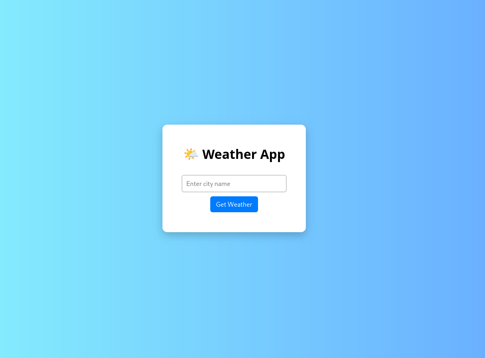

# 🌦️ Weather App

A simple **search-based weather application** that provides **current weather details** for any city in the world.  
Users can search by city name to instantly get weather information such as temperature and conditions.  

Built with **HTML**, **CSS**, and **JavaScript**, and powered by the **OpenWeather API**.

---

## ✨ Features

- 🔍 **Search by City** – Get weather details for any city worldwide.
- ⏳ **Real-Time Data** – Fetches the latest temperature and condition data.
- 🌤 **Weather Icons** – Icons that represent current weather conditions.
- 📱 **Responsive Design** – Works on mobile, tablet, and desktop.
- 🌐 **Powered by OpenWeather API**.

---

## 📸 Screenshots

---

## 🛠 Tech Stack

- **HTML5**
- **CSS3**
- **JavaScript (ES6+)**
- [OpenWeather API](https://openweathermap.org/)
